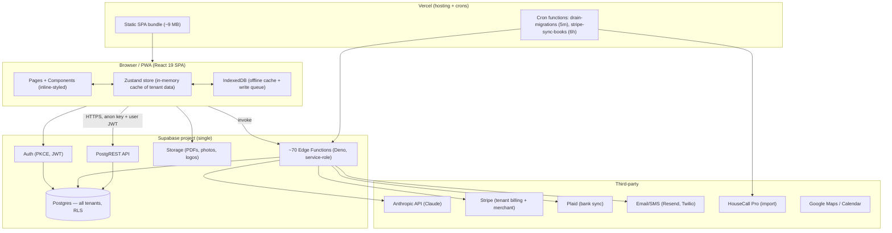
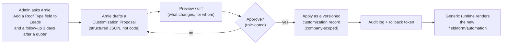

# Job Scout — System Architecture & Scalability Review

**Audience:** Incoming head of engineering / technical lead.
**Purpose:** Explain how the entire system is built, give an honest assessment of whether it can host tens of thousands of users, and propose a safe design for the idea of letting an admin use **Arnie** (our AI agent) to customize a tenant's instance.

**Status of this document:** Written from a full read of the codebase (June 2026). Line references point at real files. Where something is a risk, it's called out plainly — this is meant to be a working assessment, not a sales pitch.

---

## 0. TL;DR for the new technical lead

- **What it is:** A mature, multi-tenant field-services SaaS. A React 19 + Vite single-page PWA on Vercel, backed by **one Supabase project** (Postgres + Auth + Storage + ~70 Edge Functions). Roughly **204K LOC** of frontend, **200+ SQL migrations**, a **19-agent AI "Crew"**, Stripe-based subscription plans, and a developer-only **Data Console** admin surface.
- **Can it host tens of thousands of users?** **The foundation can; the current implementation cannot yet.** Supabase Postgres + PostgREST + serverless is a proven stack at that scale. But there are three concrete blockers that will bite well before 10,000s of users: (1) the browser loads **entire tables into memory on login**, (2) there is **no code-splitting** (single ~9 MB bundle), and (3) the system runs on **one un-pooled, un-replicated Postgres** with security that has had a turbulent history. None are architectural dead-ends; all are fixable. See [§8](#8-scalability-assessment-can-it-host-tens-of-thousands-of-users).
- **The "Arnie customizes the instance" idea:** Powerful and on-strategy, but "change the user's instance **code**" means three very different things with very different risk. The right path is **metadata-driven customization** (Arnie writes versioned *config*, not code), with actual code changes flowing through a **human-reviewed pull-request pipeline** — never an LLM mutating the shared production runtime live. See [§9](#9-the-big-idea-letting-arnie-customize-a-tenants-instance).

---

## Table of Contents

1. [System context](#1-system-context)
2. [Technology stack](#2-technology-stack)
3. [Frontend architecture](#3-frontend-architecture)
4. [Backend & data layer](#4-backend--data-layer)
5. [Multi-tenancy & security model](#5-multi-tenancy--security-model)
6. [The AI agent layer — "the Crew"](#6-the-ai-agent-layer--the-crew)
7. [Admin / super-admin surface (Data Console)](#7-admin--super-admin-surface-data-console)
8. [Scalability assessment](#8-scalability-assessment-can-it-host-tens-of-thousands-of-users)
9. [The big idea: letting Arnie customize a tenant's instance](#9-the-big-idea-letting-arnie-customize-a-tenants-instance)
10. [Open questions for the new technical lead](#10-open-questions-for-the-new-technical-lead)

---

## 1. System context



**One sentence:** every tenant runs the **same deployed codebase** and shares **one Postgres database**; tenants are separated by a `company_id` column and Postgres Row-Level Security — there is no per-tenant code or per-tenant database today. That fact is central to the customization discussion in §9.

---

## 2. Technology stack

| Layer | Choice | Notes |
|---|---|---|
| Frontend framework | **React 19 + Vite** (JSX, not TS) | SPA; PWA via `vite-plugin-pwa` (Workbox) |
| State | **Zustand** (`src/lib/store.js`) with persist + IndexedDB | Single global store, in-memory tenant cache |
| Styling | **Inline styles + theme object** (no Tailwind classes in components) | House rule in `JOBSCOUT_PROJECT_RULES.md`; Tailwind is installed but not used in JSX |
| Icons | Lucide React | "No emojis" house rule |
| Backend | **Supabase** — Postgres, Auth, Storage, Edge Functions (Deno/TypeScript) | Single project `tzrhfhisdeahrrmeksif` |
| Data access | **PostgREST** (`@supabase/supabase-js`) from the browser | No ORM; REST over HTTP |
| Serverless | ~70 Supabase Edge Functions + 2 Vercel cron functions | Edge funcs use the **service-role key** |
| AI | **Anthropic Claude** (Sonnet 4.5 for Arnie) via server-side edge functions; some Gemini Vision | Cost-metered in `_shared/anthropic.ts` |
| Payments | **Stripe** (both tenant subscriptions *and* tenants' own merchant processing), Plaid for bank sync | |
| Hosting | **Vercel** (SPA + crons), GitHub for source | |
| Observability | **Sentry** (`@sentry/react`) | Present; backend/DB observability is thin |
| Offline | IndexedDB (`idb`) + custom sync queue + photo queue | Genuine offline-first for field techs |

---

## 3. Frontend architecture

### 3.1 Shape
- A classic SPA: `src/App.jsx` defines ~100 routes; `src/components/Layout.jsx` is the nav shell; pages live in `src/pages/**`. Components are inline-styled against a theme object.
- **PWA / offline-first is real and load-bearing.** `vite.config.js` configures Workbox with `NetworkFirst` caching of Supabase REST calls and `NetworkOnly` for auth. Field techs on flaky networks are a first-class use case: the store hydrates from IndexedDB, and writes are queued (`src/lib/syncQueue.js`, `src/lib/photoQueue.js`) and flushed when back online.
- **Auth:** Supabase Auth with **PKCE**. `src/lib/supabase.js` wraps storage so the PKCE `code_verifier` survives the OAuth redirect even when Safari PWA drops `localStorage` — a thoughtful, hard-won detail.

### 3.2 The store is the heart — and the scalability hot spot
`src/lib/store.js` is a single Zustand store that, **on login, eagerly fetches almost every tenant table into browser memory** via `Promise.allSettled()` with a 15-second overall timeout. Several fetches loop through **1000-row pages with no upper bound**:

- `fetchCustomers`, `fetchLeads`, `fetchQuotes`, `fetchInvoices`, `fetchPayments` — **paginate until exhausted, no cap.**
- `fetchJobs` — hard `.limit(5000)`.
- A code comment is explicit: HHH "already has 5,799 payments; without the loop … undercounted every historical metric."

So the largest current tenant (HHH: ~3,225 customers, ~7,085 jobs, ~6,523 invoices, ~5,799 payments) pulls **~20K+ rows into the browser on every cold login.** This is the single most important thing to fix before scaling — see §8.

### 3.3 No code-splitting
`src/App.jsx` does ~100 **static** imports of page components. There is **no `React.lazy`/dynamic import**. Everything ships in one bundle; the PWA precache ceiling in `vite.config.js` was bumped to 16 MB with the comment "*bundle has crossed 9 MB … until we code-split.*" Cold start on mobile is the visible symptom.

### 3.4 Access-controlled UI
`src/lib/accessControl.js` defines a clean 6-level hierarchy used to filter nav and gate pages:

```
User (0) → Team Lead (1) → Manager (2) → Admin (3) → Super Admin (4) → Developer (5)
```

`user_role` controls permissions; the separate `role` field is a job title (e.g. "Field Tech") used for UI restrictions only. HR/payroll visibility is gated by an explicit `has_hr_access` flag, not just level. This is well-factored — **but note it is *UI* gating.** True enforcement has to live in the database (§5).

---

## 4. Backend & data layer

### 4.1 Postgres + PostgREST
- The browser talks to Postgres through **PostgREST** (HTTP). No ORM, no prepared statements, no app-server in the middle for normal CRUD. Queries are `.from(table).select().eq('company_id', …)`.
- **~200+ migrations** in `supabase/migrations/` tell the story of a fast-moving product: payroll, books, Plaid, prospecting, lawn care, utility rebates, PO system, recurring jobs, and a long RLS saga (§5).
- The schema is large (50+ tenant tables). `DATABASE_SCHEMA.md` is treated as the single source of truth for column names.

### 4.2 Edge Functions (~70)
Deno/TypeScript functions in `supabase/functions/**` handle everything the browser shouldn't: sending email/SMS/invoices, Stripe and Plaid webhooks, PDF generation, AI calls, onboarding, tax forms, and each AI agent's server logic.

**Auth pattern (important):** the representative pattern (e.g. `send-invoice`) is **service-role key + trust the `company_id` in the request body**. The function does *not* independently verify that the caller belongs to that company — it assumes the SPA's `ProtectedRoute` already gated the user. Because the service role **bypasses RLS**, a hand-crafted request with someone else's `company_id` would execute. This is a known gap (see §5/§8).

### 4.3 Crons & long jobs
- Two Vercel crons (`vercel.json`): `drain-migrations` every 5 min, `stripe-sync-books` every 6 h.
- `api/cron/drain-migrations.js` is a nice pattern: HouseCall Pro customer imports for big tenants are **chunked across cron invocations** with a saved cursor in `migration_jobs.report`, so no single function hits the timeout. It also scrubs the HCP API key from the row when done.

### 4.4 AI cost metering
`supabase/functions/_shared/anthropic.ts` wraps every Anthropic call: logs tokens + estimated USD to `ai_usage` (per company, per feature), classifies errors, and fires throttled admin alerts (once per error-kind per 6 h) into `ai_alerts` + a feedback ticket + email. Per-model pricing is hard-coded (Opus/Sonnet/Haiku). This is mature for a product this young and is exactly the substrate you want before turning agents loose at scale.

---

## 5. Multi-tenancy & security model

This is the most important section for a scale/security review, and it has real history.

### 5.1 How tenants are separated
Every tenant row carries `company_id`. A user's company is resolved from their **JWT email → `employees.email`**. The canonical helper:

```sql
-- current_user_company_ids(): the company_id(s) for the logged-in user,
-- resolved from employees.email = JWT email. SECURITY DEFINER, STABLE.
```

RLS policies named `tenant_isolation` on each protected table call this helper via `belongs_to_company(company_id)`.

### 5.2 The RLS saga (read this before judging the current state)
1. **Original sin:** every tenant table shipped with permissive `USING (true)` policies granted to PUBLIC. Postgres OR-combines policies, so any new restrictive policy was silently nullified. **Result: anonymous browsers could enumerate the entire database** — confirmed 3,225 customers / 7,085 jobs / 6,523 invoices publicly readable (`BETA_READINESS.md`).
2. **Big-bang lockdown (May 1):** dropped permissive policies, added `tenant_isolation` everywhere.
3. **Emergency revert (May 2, `…EMERGENCY_revert_rls.sql`):** the all-at-once rollout broke real workflows (the AI Crew vanished, Base Camp wouldn't load) because some required tables/paths weren't covered. RLS was disabled wholesale to restore production.
4. **Staged re-rollout (May 3–7):** RLS was re-introduced **table by table** — `customers`, `leads`, `quotes`, `jobs`, then the security-critical financials (`invoices`, `payments`, `lead_payments`). For the long tail of tables, rather than risk more breakage, they used **defense-in-depth via grant revocation**: `REVOKE` all `anon` privileges and rely on supabase-js switching authenticated users to the `authenticated` role (`step_4_revoke_anon_tenant_tables`).
5. **Developer bypass (May 15):** `current_user_company_ids()` was extended so that an employee with `is_developer = TRUE` returns **all** company IDs — one flag unlocks every gated table (needed for support/impersonation in the Data Console).

### 5.3 Current posture (accurate as of latest migration)
- ✅ **Core sensitive tables are RLS-locked** with tenant isolation: customers, leads, quotes, jobs, invoices, payments, lead_payments.
- ⚠️ **Long-tail tables rely on anon-revoke + role switching, not RLS.** Effective for browser traffic, but weaker than a policy and easy to regress when a new table is added without thinking about it.
- ⚠️ **A deliberately public set** of tables remains anon-readable (login flow, public Lenard intake agents, shared reference data like fixture catalogs).
- ⚠️ **Edge functions use the service role and trust `company_id` in the body** — RLS doesn't protect that path at all.
- 🔴 **A single boolean (`is_developer`) grants cross-tenant read/write to everything**, with no second factor and best-effort audit. Tightly controlled today (one person), but it is the highest-leverage credential in the system.

### 5.4 Audit logging
An `audit_log` table + triggers capture INSERT/UPDATE/DELETE (old/new JSON, user_email, company_id) on the major tables. The Data Console exposes it with filters. Caveat: audit failures are intentionally swallowed so they can't block writes — fine for resilience, but means "no audit row" ≠ "nothing happened."

**Bottom line on security:** the team has already lived through the worst-case (public data leak) and built real machinery to fix it. The current model is *defensible* but *inconsistent* — a mix of RLS, grant-revocation, and frontend trust. For 10,000s of tenants you want **one uniform rule**: RLS on by default for every tenant table, edge functions that verify the caller's JWT rather than trusting the body, and the developer bypass hardened.

---

## 6. The AI agent layer — "the Crew"

This is the product's signature, and it's more substantial than most "AI assistant" bolt-ons.

### 6.1 Arnie (the hub)
- **Model:** Claude **Sonnet 4.5**, called **server-side** from the `arnie-chat` edge function (API key never reaches the browser), streamed back over SSE.
- **System prompt** is assembled in layers (`arnieEngine.js`): persona + role-based permission rules, a pre-fetched **data context** for the company, and **0–3 "Knowledge Cards"** injected when the user mentions a feature.
- **Tools — all read-only.** Arnie has 7 query tools (`query_invoices`, `query_jobs`, `query_revenue`, `query_leads`, `query_customers`, `query_employees`, `query_inventory`), each auto-scoped to `company_id` and some gated by role (e.g. `query_revenue` is owner-only). They run server-side in a ≤5-round tool loop. **Arnie inspects and advises; it cannot write to the database or change state.** That's a deliberate, safe boundary — and an important starting point for §9.

### 6.2 The feature-knowledge system (a hidden asset)
`src/lib/featureKnowledge/**` is a set of **structured, machine-readable specs — one per feature/page** — with `whatItIs`, `howItWorks`, `examples`, `gotchas`, `faqs`, `setup.steps`, plus narration for walkthroughs, and `lastVerified`/`freshUntil` freshness stamps. The same cards drive (a) Arnie's grounding, (b) the in-app walkthroughs/video library, and (c) the Help reference. A **drift detector** (`driftDetector.js`, surfaced in the Data Console) flags stale cards.

> **Why this matters for the future:** you already have a maintained, machine-readable model of what the app *is*. That is exactly the grounding an agent needs to safely reason about — and eventually customize — the system. Most teams attempting "AI that changes the app" have to build this substrate from scratch; here it exists.

### 6.3 The rest of the Crew
Agents are **licensed per tenant**: a global `agents` catalog + a `company_agents` join (with `subscription_status`); the store's `hasAgent(slug)` gates data fetches and nav, and `recruitAgent()` activates one. Plans cap how many agents a tenant gets (`agent_cap` in `billingPlans.js`).

| Agent | Domain | Notes |
|---|---|---|
| **Arnie** | General copilot / hub | Read-only tools + full feature knowledge |
| **Lenard** | Lighting audits | Vision: identify LED fixtures, compute rebates; also powers **public** intake pages |
| **Freddy** | Fleet | Maintenance, tracking, inspections |
| **Conrad** | Email marketing | Campaigns/automations, Constant Contact |
| **Victor** | Photo verification | Before/after job completion proof |
| **Frankie** | "AI CFO" | Cash flow, AR/AP aging, profitability |
| **Dougie** | Document OCR | Bills/receipts → structured JSON, per-tenant correction learning |
| **Zach** | Lawn care | Property/visit/treatment/pricing |

Architecturally these are **independent silos** — each with its own edge function, data model, and UX — unified loosely by the `ai_modules`/`agents` tables and the shared Anthropic wrapper. There is an emerging "agent framework" but it is not yet a true plugin runtime. Consolidating these onto one agent-runtime contract is a natural early initiative for the new lead.

---

## 7. Admin / super-admin surface (Data Console)

`src/pages/admin/DataConsole*` is a **developer-only** (`is_developer` / level 5) admin app, gated in routing and nav, and bootstrapped to Bryce's account. It is sold as a Field Boss feature but is really platform-operator tooling. Capabilities:

| Console | What it does | Risk |
|---|---|---|
| **SQL Runner** | Read-only `SELECT` via the supabase-js builder (not raw SQL) — saved queries, CSV export | Low (read-any-table) |
| **Browser** | View **and edit** any row in any major table | High once combined with the dev RLS bypass |
| **Bulk Ops** | CSV → batch INSERT into any major table | Medium (no transaction; partial-failure risk) |
| **Companies** | List all tenants, edit tier/billing/active, **impersonate** a tenant | Medium |
| **System** | CRUD a global `system_settings` key-value store | Medium (no validation; can toggle behavior) |
| **Agents** | CRUD the agent catalog | Low |
| **Migrations** | **View-only** history of import/backfill jobs | None |
| **Drift** | Flag/snooze stale knowledge cards | None (manual fixes) |
| **Audit Log** | Read change history across major tables | None |

**Security read:** the Data Console + the `is_developer` RLS bypass together form an effectively unrestricted, cross-tenant control plane behind one flag. That's normal for an early-stage operator console, but at 10,000s of tenants it needs: scoped/temporary elevation, mandatory audit (not best-effort), confirmation on cross-tenant writes, and ideally a second factor. This console is also the natural home for the super-admin customization features in §9.

---

## 8. Scalability assessment: can it host tens of thousands of users?

**Verdict: yes on the stack, not yet on the implementation.** Supabase/Postgres/PostgREST/serverless routinely serves products at this scale. Nothing here is an architectural dead-end. But the following must be addressed, roughly in priority order.

### 🔴 P0 — will break first
| Risk | Why it bites | Fix |
|---|---|---|
| **Whole tables loaded into the browser on login** (`store.js`) | A single large tenant already pulls ~20K rows per cold login; this grows linearly and is unbounded for customers/leads/quotes/invoices/payments. Memory + load-time + bandwidth all scale the wrong way. | Move to **server-side pagination / virtualized lists / on-demand fetch**. Load dashboards from **aggregate queries or DB views**, not by summing every row client-side. This is the highest-ROI change. |
| **No code-splitting; ~9 MB single bundle** | Cold start on mobile (the field-tech reality) is slow; gets worse as features grow. | **Route-level `React.lazy` + dynamic imports**; split vendor chunks (PDF/charts/maps already candidates). Expect a large, fast win. |
| **Single Postgres, no pooling strategy stated** | Serverless edge functions open fresh connections per invocation; a login stampede (8am crews) can exhaust connection limits. | Put PostgREST/edge traffic behind **Supabase's pooler (Supavisor)**; load-test concurrency; plan **read replicas** for reporting. |

### 🟠 P1 — security & correctness at scale
| Risk | Fix |
|---|---|
| **Inconsistent tenant enforcement** (RLS on core tables, grant-revoke on the long tail, frontend trust elsewhere) | Make **RLS-on-by-default** the standard for every tenant table; add a CI check that fails if a new tenant table ships without a policy. |
| **Edge functions trust `company_id` in the body under service role** | Verify the **caller's JWT** in each function and derive `company_id` server-side; reserve service-role for genuinely system operations. |
| **`is_developer` = god mode via one boolean** | Scoped, time-boxed elevation; mandatory (non-swallowed) audit on cross-tenant access; 2FA for developer accounts. |
| **No rate limiting on edge functions** | Add per-tenant/per-IP rate limits, especially on AI and email/SMS endpoints (cost + abuse). |

### 🟡 P2 — operability
- **Observability is thin** below the frontend (Sentry is client-side). Add DB/edge metrics, slow-query logging, and per-tenant usage dashboards (the `ai_usage` pattern is a good template to generalize).
- **Large-row footguns** already appear (audit `notes` rows >10 MB excluded from list fetch). Audit column-level bloat and large JSON blobs.
- **N+1 / fat joins** in store fetches — review `select` shapes as tenants grow.
- **Per-row RLS helper cost** — `current_user_company_ids()` is `STABLE` (planner can cache within a statement), but validate query plans on the biggest tables once data grows.

### What's already good (don't regret-rewrite these)
- Offline-first sync, PWA storage hardening, chunked long-running imports, AI cost metering + alerting, a clean access-control module, the machine-readable feature-knowledge layer, and an audit-log foundation. These are signs of a team that has already hit real production problems and engineered around them.

**Net:** a focused 1–2 quarter hardening effort (data loading, code-splitting, uniform RLS, connection pooling, observability) gets this comfortably into "tens of thousands of users" territory on the current stack. No re-platform required.

---

## 9. The big idea: letting Arnie customize a tenant's instance

> *"Allowing the super admin or some level of access to use Arnie to change the user's instance (code) to do tasks and customize parts of the system to meet the instance's needs."*

This is a strong strategic direction — it's essentially what the original AppSheet app gave you (per-customer customization) and what makes vertical SaaS sticky. But the phrase "change the instance **code**" hides three very different capabilities, and conflating them is where products like this get dangerous. Start by separating them.

### 9.1 First, the architectural constraint
**Today there is no per-tenant code and no per-tenant database.** Every tenant runs the same Vercel deployment against one Postgres, separated by `company_id`. So "customizing a tenant" can mean:

| Tier | What "customize" means | Where it lives | Risk | Verdict |
|---|---|---|---|---|
| **A. Configuration** | Toggle features, rename labels, define pipeline stages, service types, statuses, agent recruitment, notification rules | `settings` / `system_settings` / `company_agents` rows (already exist) | Low | **Ship this first** — mostly plumbing Arnie into existing tables |
| **B. Declarative customization (metadata)** | Custom fields, custom forms/objects, custom workflows/automations, custom report definitions, conditional logic | New per-tenant **metadata** rows, interpreted by a generic runtime (the `custom_forms` table already hints at this) | Medium | **The real product direction** |
| **C. Actual code** | Generate JS/React/SQL that executes to do something the platform can't express declaratively | A deployed artifact or runtime-executed code | High → very high | **Never let an LLM mutate the shared runtime live.** Route through a reviewed PR pipeline or a sandbox |

### 9.2 Why arbitrary "AI writes and runs code in the app" is the wrong default
In a single-codebase, single-database, multi-tenant system, LLM-generated code executing in the shared runtime means **one tenant's customization can break or read every other tenant's data.** Concretely:
- A generated query without a `company_id` filter, or that runs under service-role, is a cross-tenant data leak.
- A generated React component with an infinite loop or a bad dependency degrades the bundle for *everyone*.
- "Per-tenant deployed code" (the other interpretation) destroys the economics: you cannot operate 10,000 separate deployments/branches and still ship a fix once. It also defeats the single-bundle model entirely.

So the rule of thumb: **the LLM produces a *proposal* (config, metadata, or a code diff); a deterministic system or a human applies it under guardrails.** Never `eval` the model's output against production.

### 9.3 Recommended model: *propose → preview → approve → apply (versioned) → audit → rollback*
Arnie is already the perfect front door for this because it's read-only and grounded in the **feature-knowledge** layer. Extend it from "advise" to "draft a change," keeping a hard wall between drafting and applying:



- **Proposal, not code.** Arnie emits a typed object the platform understands (a new field definition, a form, an automation rule, a report). Validate it against a schema before anything touches the tenant.
- **Preview & blast radius.** Show the admin exactly what changes and confirm it's scoped to their `company_id`.
- **Role-gated approval.** Map to the existing hierarchy: a **tenant Admin/Super Admin** approves changes to *their own* instance (Tiers A–B); a **platform Developer** is the only one who can touch shared code (Tier C).
- **Versioned + reversible.** Every applied customization is a row with a version and a rollback path. You already have `audit_log` and a Data Console to surface this.

### 9.4 Where each tier should actually be built
- **Tier A (now):** give Arnie a small set of **write tools** that only touch `settings`/`system_settings`/`company_agents`, each wrapped in the propose→approve→audit flow. Low risk, high perceived magic ("Arnie, turn on the customer portal and rename 'Leads' to 'Opportunities'").
- **Tier B (the roadmap):** build a **metadata runtime** — custom fields/objects/forms/automations/reports stored per tenant and interpreted generically. `custom_forms` is an existing seed. This is how Salesforce, Airtable, Retool, and your own predecessor AppSheet scale customization to thousands of tenants *without* per-tenant code. Arnie becomes the natural-language author of that metadata. This is the durable moat.
- **Tier C (rare, controlled):** when something genuinely needs code, **do not** mutate the running app. Two safe outlets:
  1. **Reviewed PR pipeline** — the agent opens a pull request (this very repo already runs agents that do exactly this), CI runs, a human reviews, it deploys to all tenants behind a feature flag. Good for platform-wide capabilities born from one tenant's request.
  2. **Sandboxed per-tenant execution** — for true per-tenant logic, run it in an **isolated sandbox** (e.g. a constrained serverless/Vercel Sandbox or a capability-scoped edge function) with no ambient DB credentials, only a narrow, `company_id`-scoped API. Never in the shared SPA runtime.

### 9.5 Guardrails to decide *now* (cheap early, expensive later)
- **Capability allow-list:** enumerate exactly what an agent-driven change may touch; deny by default. Tenant-scoped writes can never address another `company_id`.
- **Human-in-the-loop by tier:** Tiers A–B require tenant-admin approval; Tier C requires platform-developer review. No silent self-apply.
- **Schema-validate every proposal** before apply; reject anything that doesn't type-check.
- **Mandatory, non-swallowed audit** for agent-applied changes, with one-click rollback.
- **Cost & rate limits** on the authoring agent (reuse the `ai_usage`/`ai_alerts` machinery).
- **Tighten the developer bypass first** — if super-admins gain customization power, the `is_developer` flag becomes even more security-critical (§5/§8).

### 9.6 Honest take
The instinct is right and the platform is unusually well-positioned (grounded feature knowledge, an existing read-only agent, an audit log, an admin console). The trap is the literal reading — "Arnie changes the code." Reframe it as **"Arnie authors versioned, tenant-scoped customizations that a generic runtime executes, with a human approving anything risky and a developer pipeline for the rare real-code case."** That gets you 90% of the wow with a fraction of the risk, and it's the only version that survives contact with 10,000 tenants.

---

## 10. Open questions for the new technical lead

1. **Data loading:** server-side pagination + aggregate views is P0. Who owns the store refactor, and can we ship it behind a flag tenant-by-tenant?
2. **RLS uniformity:** do we commit to RLS-on-by-default for every tenant table (with a CI guard), and migrate the grant-revoke long tail onto policies?
3. **Edge-function auth:** standardize on verifying the caller JWT instead of trusting `company_id` in the body?
4. **Developer bypass:** scope/time-box it, add 2FA, make its audit mandatory — before expanding super-admin power.
5. **Agent runtime:** consolidate the 8 bespoke agents onto one contract, or keep them as silos a while longer?
6. **Customization strategy:** do we commit to the **metadata runtime (Tier B)** as the product direction, and treat Tier C code changes strictly as reviewed PRs / sandboxes?
7. **Scale target:** what's the real near-term tenant/user count and the largest expected tenant? That sizes the pooling/replica plan.

---

*Generated from a full read of the repository. File and line references are accurate as of the latest migration on the working branch; treat the scalability and security items as a prioritized backlog, not a list of failures — most reflect a product that has already survived real production load and iterated through it.*
